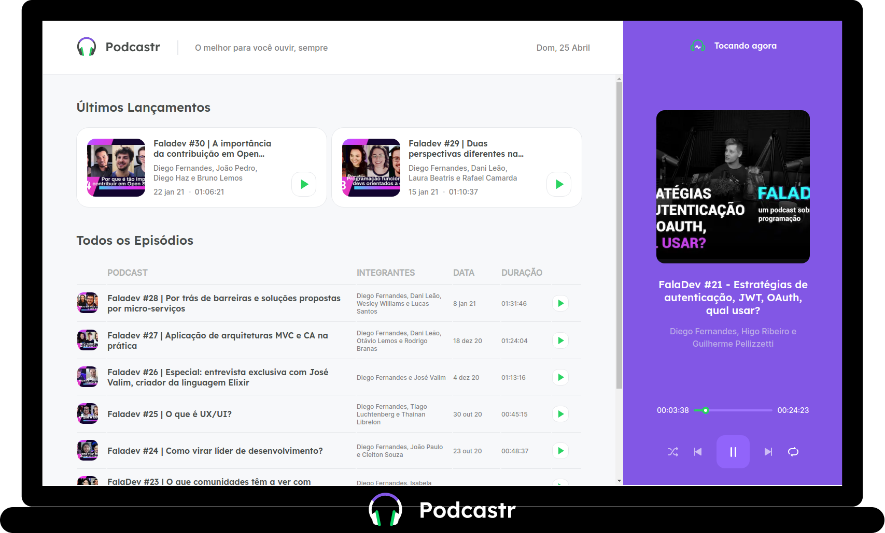

<!-- @format -->

<h1 align="center">
  
</h1>

## 🔮 Sobre o projeto

O Podcastr é uma aplicação web desenvolvida durante o evento **Next Level Week** utilizando Next.js. Nele é possível ouvir seus podcast favoritos.

## 🎲 Como rodar o projeto

```bash
# Clone este repositório
$ git clone https://github.com/vitorsemidio-dev/podcastr

# Acesse a pasta do projeto no terminal/cmd
$ cd podcastr

# Instale as dependências
$ npm install

# Execute o servidor
$ npm run server

# Execute a aplicação em modo de desenvolvimento
$ npm run dev

# Acesse o endereço http://localhost:3000
```

## 📸 Imagens do Projeto

### Home



### Detalhe do Episódio

<p align='center'>
  
</p>

## 🛠 Tecnologias

- [Next.js](https://nextjs.org/)
- [ReactJS](https://pt-br.reactjs.org/)
- [TypeScript](https://www.typescriptlang.org/)
- [Date fns](https://date-fns.org/)
- [Styled Components](https://styled-components.com/)
- [Axios](https://github.com/axios/axios)
